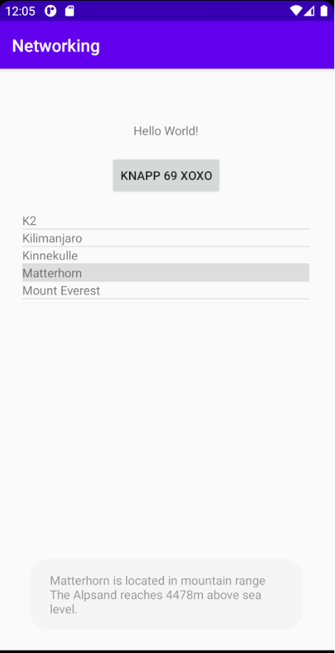

# Rapport

Först skulle det läggas till en ListView och det gjordes i Xml filen activity main. Därefter skapades
också en ny java klass som heter Mountaain.java och även en till xml fil med en textView i sig.

I MainActivity.java har det skapats 2 variablar. Den ena Heter ArrayList och den andra heter ArrayAdapter.
Under visas koden för skapandet av dem.

```
    private ArrayList<Mountain> mountainArrayList=new ArrayList<>();
    private ArrayAdapter<Mountain> adapter;
```

I detta steget så har det skapats en konstruktior i classen Mountain. Denna kod visas nedan.

```
package com.example.networking;

public class Mountain {
    private String name;
    private String location;
    private int height;
    public Mountain (String n, String l, int h) {
        name=n;
        location=l;
        height=h;
    }
    public String info(){
        String tmp = new String();
        tmp+=name+" is located in mountain range "+location+"and reaches "+height+"m above sea level.";
        return tmp;
    }
    @Override
    public String toString(){
        return name;
    }
}
```
I mountain kommer värden sparas och användas för att skriva ut en toast och för att visa upp informationen
i den listView som skapades tidigare.

Sedan kopplas ArrayAdapter ihop med ArrayList och även med en av de textView som finns.
Nu gavs appen tillstånd att använda sig av internet. Och detta gjordes likt tidigare uppgifter i
AndroidManifest. I detta steget fördes även den kod som skall hämta data från web servern. Denna Json task
lades till längst ner i MainActivity. Efter att den hade lagts till används nedanstående kod för att parsa den
data som kommer från webb servern.

```
 @Override
        protected void onPostExecute(String json) {
            try{
                mountainArrayList.clear();
                JSONArray jsonArray = new JSONArray(json);
                for (int i = 0; i < jsonArray.length(); i++){
                JSONObject jsonObject = jsonArray.getJSONObject(i);

                String name = jsonObject.getString("name");
                String location = jsonObject.getString("location");
                int height = jsonObject.getInt("size");
                Mountain mountain = new Mountain(name,location,height);
                mountainArrayList.add(mountain);
                }
                adapter.notifyDataSetChanged();


            } catch (JSONException e) {
                Log.d("JSONbajs", json+e);
            }
```

Efter detta var det bara mindre ändringar med hur layouten skulle vara.
Kommande bilder visar hur appen ser ut.





